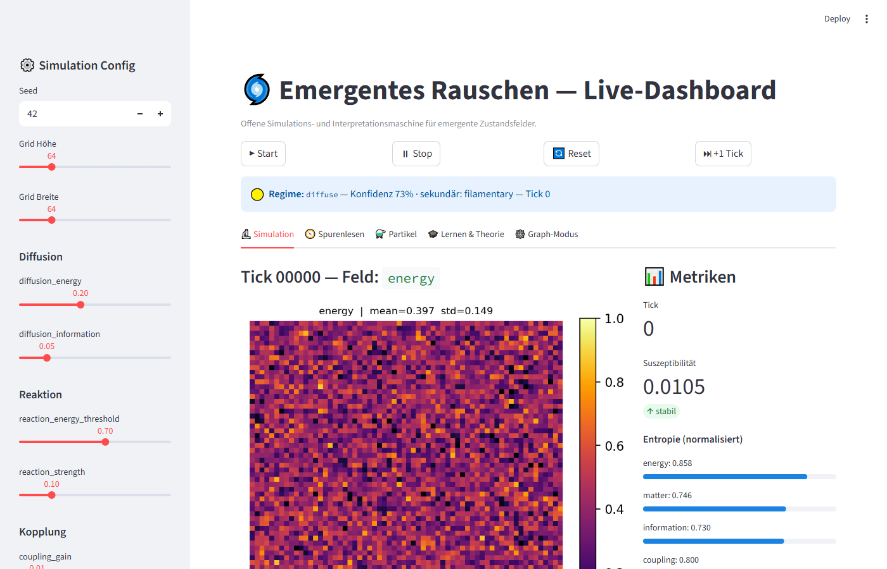
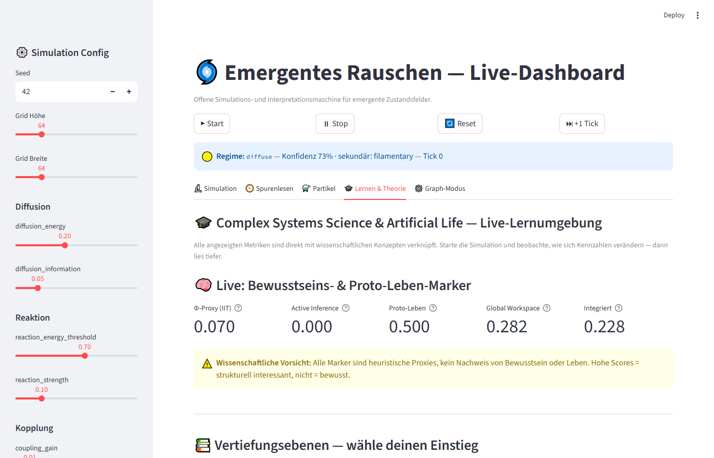
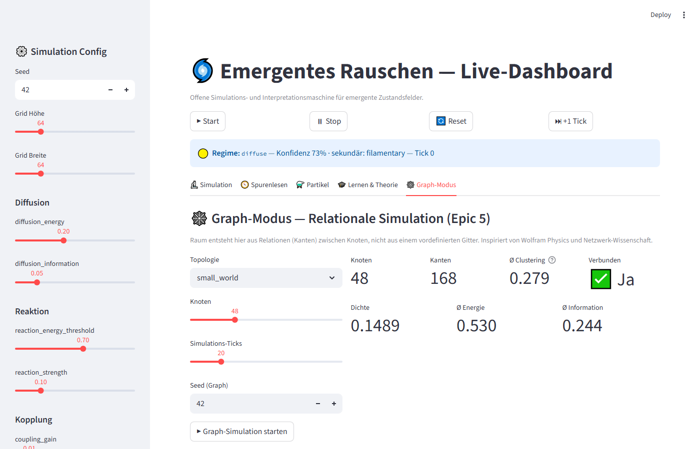
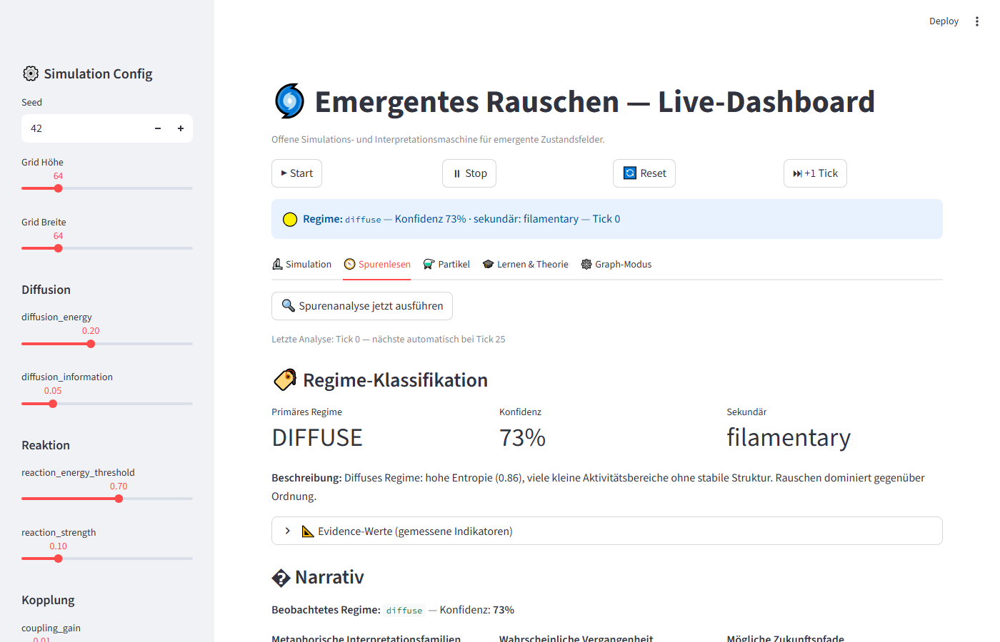

# Emergentes Rauschen

> A research sandbox for studying how structured noise, local rules, memory, coupling
> and information flow generate emergent regimes — readable as traces, proto-life markers,
> adaptive structures and relational geometries.

[](https://github.com/FelixGitReporian/emergentes-rauschen/actions)
[](https://www.python.org/)
[](LICENSE)
[](#tests)
[](CHANGELOG.md)

---

## Was ist Emergentes Rauschen?

Ein **offenes Forschungswerkzeug** für die Frage:
*Wie entstehen aus einfachen lokalen Regeln emergente Regime — Muster, Grenzen, Gedächtnis,
adaptive Strukturen?*

Das Kernsystem ist ein 2D-Zustandsfeld aus **8 gekoppelten Feldern**, die sich nach deterministischen
Regeln bei jedem Tick aktualisieren:

| Feld | Rolle |
|------|-------|
| `energy` | Aktivierungspotenzial, treibende Kraft |
| `matter` | Lokale Dichte, Substrat, Trägheit |
| `information` | Komprimierbare Ordnung, lokaler Mustergehalt |
| `coupling` | Stärke der Nachbarschaftsverbindungen |
| `reactivity` | Wahrscheinlichkeit lokaler Transformationen |
| `memory` | Sedimentierte Vergangenheit, Hysterese |
| `coherence` | Lokale Synchronität, Musterstabilität |
| `flow` | Gerichteter Fluss, Vektordynamik, Advektion |

Ein **Analyse-Layer** liest die entstehenden Muster: Attraktoren, Regime-Typen, Cluster, Spuren,
proto-kompartimentelle Strukturen. Ein **Lern-Dashboard** verbindet die Live-Simulation direkt
mit wissenschaftlichen Theorien (IIT, Free-Energy, GWT, ALife).

> **Wissenschaftlicher Rahmen:** Dieses System beweist keine Theorie. Es erzeugt Strukturen,
> die mit Metriken aus Complex-Systems-Forschung und ALife analysiert werden. Alle Marker
> (Φ-Proxy, Proto-Leben-Score, etc.) sind heuristische Proxies — nützlich zum Explorieren,
> kein Nachweis von Bewusstsein oder Leben.
>
> Weiterführende Abgrenzung: [docs/scientific-scope.md](docs/scientific-scope.md)

**Inspirationsquellen** (kein Anspruch auf Äquivalenz):
Lenia / Flow-Lenia, Reaktions-Diffusion-Systeme, Wolfram-Hypergraphen (strukturell),
IIT / Active Inference / GWT (als Proxy-Metriken), Causal Sets (konzeptuell).

---

## Schnellstart

```bash
git clone https://github.com/FelixGitReporian/emergentes-rauschen.git
cd emergentes-rauschen
pip install -e ".[dev]"

# Live-Dashboard
pip install -e ".[dashboard]"
python -m streamlit run src/emergent_noise/visualization/dashboard.py

# Reproduzierbares Experiment (CSV-Output)
python -m emergent_noise.experiments.runner -e stability_sweep
```

---

## Dashboard

<!-- Screenshots erzeugen: python examples/capture_dashboard.py -->
<!-- Danach werden diese Zeilen automatisch befüllt:            -->

| Simulation | Lernen & Theorie |
|:---:|:---:|
|  |  |

| Graph-Modus | Spurenlesen |
|:---:|:---:|
|  |  |

> Regenerate screenshots: `python -m pip install playwright` then `python -m playwright install chromium`
> then `python examples/capture_dashboard.py`

5 Tabs:
- **🔬 Simulation** — Live-Heatmap, RGB-Composite, Entropie-Zeitreihe, Regime-Klassifikation
- **🧭 Spurenlesen** — Attraktoren, MI-Matrix, Morphologie, Narrativ-Text
- **⚗️ Partikel** — Partikel-Scatter, Dichtekarte, Proto-Kompartimente, Genome
- **🎓 Lernen & Theorie** — Live-Bewusstseins-Marker, 3 Vertiefungsebenen (Einstieg → Forschungsfront), Attraktor-Trajektorie, Glossar, 15+ Lernquellen
- **🕸️ Graph-Modus** — NetworkX-Simulation (4 Topologien), emergente Distanzmatrix, Wolfram-Rewriting

---

## Experiment Gallery

The project includes a growing collection of **reproducible simulation presets** — each a small
research object with config, inspiration, expected patterns, limitations and suggested metrics.

| Preset | Category | Description |
|--------|----------|-------------|
| Stigmergy / Ant Trails | Collective Behavior | Indirect coordination through persistent memory traces |
| Boids Field Approximation ⚠️ | Collective Behavior | Flock-like movement via field coupling and flow |
| Tree Growth / Branching Morphogenesis | Morphogenesis | Branch-like structures via memory stabilisation |
| Reaction-Diffusion / Turing-like Patterns | Pattern Formation | Spots, stripes and reaction fronts |
| Excitable Media / Wave Propagation | Bio-inspired Dynamics | Threshold-driven activity waves |
| Trace Reading / Fossil Field | Trace Reading | Long-lived memory accumulation and trace inference |
| Autopoiesis / Membrane Formation | Artificial Life | Boundary formation and self-maintenance |
| Ecosystem Patch Dynamics | Ecology | Resource patches, succession, disturbance |

> These presets are not claims of exact biological or physical realism.
> They are exploratory field experiments for studying **emergent analogues**.

**Browse the gallery:** Open the **🎓 Lernen & Theorie** tab in the dashboard.

**Apply a preset:**
```bash
python -m streamlit run src/emergent_noise/visualization/dashboard.py
# → sidebar: select Preset Category → Preset → ▶ Apply Preset & Reset
```

**Run from CLI:**
```bash
python examples/run_preset.py --list
python examples/run_preset.py --preset stigmergy_ant_trails --steps 500
```

**Full documentation:** [`docs/experiments/`](docs/experiments/index.md)

---

## Results

Reproducible experiment results are documented in [`docs/results/`](docs/results/):

| Document | Summary |
|---|---|
| [benchmark-10k-stability-sweep.md](docs/results/benchmark-10k-stability-sweep.md) | 10k-tick stability sweep across 6 noise levels; 32×32 (~188 ticks/s) and 64×64 (~115 ticks/s). Regime transition at noise≈0.05. Compartments peak at noise=0.10. |
| [experiment-reaction-diffusion-memory.md](docs/results/experiment-reaction-diffusion-memory.md) | 36-run parameter sweep (`memory_decay` × `diffusion_energy`). Diffusion dominates over memory decay. Low diffusion → higher compartment count. Higher memory retention → slightly higher integrated score. |

Raw CSV data is gitignored but fully reproducible:
```bash
python examples/benchmark_10k.py --grid 32
python -m emergent_noise.experiments.runner -e reaction_diffusion_memory
```

---

## Tests

```bash
python -m pytest          # alle Tests
python -m pytest -v       # mit Details
```

**Aktuell: 172 Tests, alle grün** — abgedeckt: Regeln, Entropie, Attraktoren, Spurenlesen,
Meta-Evolution, Partikel, Kompartimente, Graph-Modus, Mehrskaligkeit, Bewusstseins-Marker,
Experiment-Runner.

---

## Projektstruktur

```
src/emergent_noise/
  core/
    state.py            SimConfig (Pydantic v2) + GridState
    tick.py             Tick-Loop: noise→diffusion→reaction→coupling→flow→memory→meta_rules→clip
    particles.py        Partikel-System (NumPy-vektorisiert)
    graph_state.py      GraphState (NetworkX): 4 Topologien, Rewriting, Distanzmatrix
    multiscale.py       MesoLayer + AttractorLandscape + MultiscaleController
  rules/                diffusion, reaction (Genome), coupling, flow, memory, meta_rules
  noise/                structured_noise (deterministisch, Seed+Tick)
  analysis/             entropy, attractors, morphology, mutual_information,
                        trace_reading, novelty, compartments
  interpretation/       regime_classifier (8 Typen), narratives, consciousness
  experiments/          configs (7 Experimente), runner (Config-Sweep, CSV, Git-Hash)
  visualization/        render, dashboard (5 Tabs)

tests/                  172 pytest-Tests
docs/
  design-decisions/     ADR-0001 … ADR-0007
  results/              Benchmark + experiment result summaries
  scientific-scope.md   Was das Projekt kann und was nicht
  research-context.md   Einordnung: ALife, Wolfram, IIT, Free-Energy
outputs/                Simulationsergebnisse (gitignore, reproducible)
```

---

## Konfiguration

Alle Parameter sind in `SimConfig` definiert — **keine magischen Zahlen in Modulen**:

```python
from emergent_noise.core.state import SimConfig, GridState
from emergent_noise.core.tick import TickLoop

config = SimConfig(
    height=128, width=128, seed=42,
    diffusion_energy=0.2,
    coupling_gain=0.01,
    flow_gradient_strength=0.1,
    memory_decay=0.97,
    noise_amplitude=0.02,
    # ... alle Parameter dokumentiert in SimConfig
)

state = GridState.initialize(config)
loop = TickLoop(config)
loop.run(state, n_ticks=1000)
```

---

## Tick-Reihenfolge

Jeder Simulationsschritt führt 8 Regeln in dieser fixen, dokumentierten Reihenfolge aus:

```
1. Strukturiertes Rauschen    (Symmetriebrechung)
2. Diffusion                  (Energie + Information)
3. Reaktion                   (lokale Transformation)
4. Kopplung                   (Netzwerkbildung, Kohärenz-Synchronisation)
5. Fluss                      (Vektordynamik, Wirbel, Advektion)
6. Gedächtnis                 (Hysterese / Spurenbildung)
7. Clip auf [0, 1]
8. tick++
```

---

## Analyse-Layer

```python
from emergent_noise.analysis.entropy import state_entropy_summary
from emergent_noise.analysis.attractors import (
    PersistenceTracker, find_clusters, compute_phase_indicator
)

entropy = state_entropy_summary(state)          # Entropie aller Felder
clusters = find_clusters("energy", state.energy, threshold=0.6)
phase = compute_phase_indicator(state.tick, state.as_dict())

print(f"Energie-Cluster: {clusters.n_clusters}")
print(f"Phasenübergang nahe: {phase.near_transition}")
```

---

## Current Status

| Version | Epic | Ziel | Status |
|---------|------|------|--------|
| v0.1.0 | Epic 0 | Grid, Regeln, Tests | ✅ |
| v0.2.0 | Epic 1 | 8 Parameter, Dashboard, Attraktoren | ✅ |
| v0.3.0 | Epic 2 | Spurenlese-Engine, Regime-Klassifikation | ✅ |
| v0.4.0 | Epic 3 | Meta-Regel-Evolution, Genome-Diversität | ✅ |
| v0.5.0 | Epic 4 | Partikel-Feld-Hybrid, Proto-Kompartimente | ✅ |
| v1.0.0 | Epic 5–6 | Graph-Modus (NetworkX), Mehrskalenmodell (Meso/Makro) | ✅ |
| v2.0.0 | Epic 7–8 | Experiment-Framework, Bewusstseins-Marker, Lern-Dashboard | ✅ |

**Tests: 172 passing** · **Python 3.11+** · **Alle Epics abgeschlossen**

Vollständige Roadmap: [ROADMAP.md](ROADMAP.md)

---

## Beitragen

Beiträge sind willkommen! Bitte lies [CONTRIBUTING.md](CONTRIBUTING.md) und
halte den [Code of Conduct](CODE_OF_CONDUCT.md) ein.

```bash
# Feature-Branch
git checkout -b feature/mein-feature

# Tests laufen lassen
python -m pytest

# Pull Request auf develop
```

---

## Lizenz

MIT — siehe [LICENSE](LICENSE).

---

## Wissenschaftliche Abgrenzung

Dieses Projekt ist ein **experimentelles Forschungsinstrument**, kein Nachweis einer Theorie.
Es generiert Selbstorganisations-Experimente, analysiert Muster und entwickelt Hypothesen.

- Was es kann und was es nicht behauptet: [docs/scientific-scope.md](docs/scientific-scope.md)
- Wissenschaftlicher Kontext (ALife, Wolfram, IIT, Free-Energy): [docs/research-context.md](docs/research-context.md)
- Architekturentscheidungen: [docs/design-decisions/](docs/design-decisions/)
